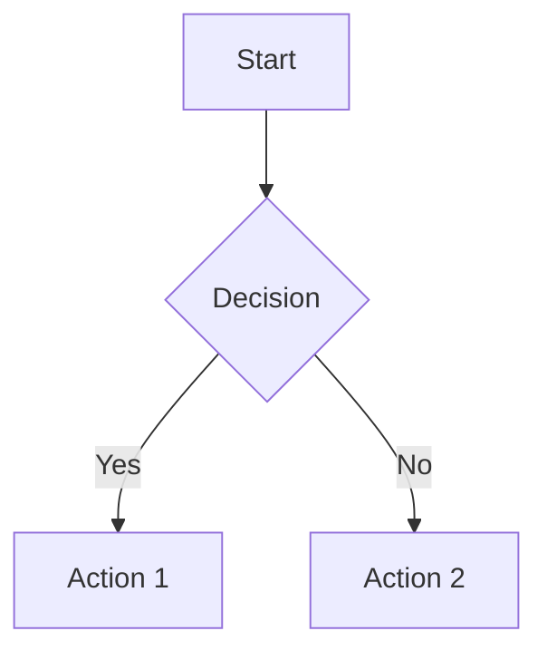

# md-mermaid-chart-pdf-mcp

[](https://badge.fury.io/js/md-mermaid-chart-pdf-mcp)
[](https://opensource.org/licenses/MIT)

A powerful Model Context Protocol (MCP) server that converts Markdown files and content to beautifully styled PDFs with Mermaid diagram support.

## ✨ Features

- 🔄 **Two conversion modes**: File-to-PDF and content-to-PDF
- 📊 **Charts & diagrams**: Mermaid diagrams + ApexCharts support
- 🎨 **Modern styling**: Professional typography with Inter font and syntax highlighting
- 📄 **Multiple formats**: A4, A3, A5, Letter, Legal, Tabloid
- ⚙️ **Configurable margins**: Custom spacing in inches, mm, cm
- 📝 **Front matter support**: YAML metadata for document properties
- 🎯 **Accessibility**: Tagged PDFs with proper outline structure

## 🚀 Quick Start

### Option 1: Use with npx (Recommended)
```bash
npx md-mermaid-chart-pdf-mcp
```

### Option 2: Global Installation
```bash
npm install -g md-mermaid-chart-pdf-mcp
md-mermaid-chart-pdf-mcp
```

## 🔧 Claude Desktop Integration

Add to your Claude Desktop configuration:

**Windows**: `%APPDATA%\Claude\claude_desktop_config.json`
**macOS**: `~/Library/Application Support/Claude/claude_desktop_config.json`

```json
{
  "mcpServers": {
    "markdown-pdf": {
      "command": "npx",
      "args": ["md-mermaid-chart-pdf-mcp"]
    }
  }
}
```

Restart Claude Desktop after configuration.

## 📖 Usage Examples

### Convert Markdown File to PDF
```
"Convert my README.md file to PDF and save it as documentation.pdf"
```

### Convert Markdown Content to PDF
```
"Take this markdown content and create a PDF with A4 format:
# My Document
This is **bold** text with a [link](https://example.com)
"
```

### Custom Formatting
```
"Convert the markdown file with custom margins of 1 inch on all sides and Letter format"
```

### Charts & Diagrams

**ApexCharts:**
```markdown
# Sales Data

```chart
{
  "chart": { "type": "line", "height": 350 },
  "series": [{ "name": "Sales", "data": [30, 40, 35, 50, 49, 60, 70] }],
  "xaxis": { "categories": ["Jan", "Feb", "Mar", "Apr", "May", "Jun", "Jul"] }
}
```
```

**Mermaid:**
```markdown

```

## 🛠️ Available Tools

### `convert_markdown_to_pdf`
Converts a markdown file to PDF.

**Parameters:**
- `markdownPath` (string): Path to the markdown file
- `outputPath` (string): Where to save the PDF
- `format` (optional): Page format (A4, A3, A5, Letter, Legal, Tabloid)
- `margin` (optional): Custom margins object

### `markdown_content_to_pdf`
Converts markdown content directly to PDF.

**Parameters:**
- `markdownContent` (string): Markdown content to convert
- `outputPath` (string): Where to save the PDF
- `title` (optional): Document title
- `format` (optional): Page format
- `margin` (optional): Custom margins object

## 🎨 Supported Markdown Features

- **Headers**: H1-H6 with modern styling
- **Text formatting**: Bold, italic, strikethrough
- **Lists**: Ordered and unordered with custom bullets
- **Tables**: Styled with alternating row colors
- **Code blocks**: Syntax highlighting for 100+ languages
- **Blockquotes**: Elegant left-border styling
- **Links**: Styled with hover effects
- **Images**: Embedded with proper scaling
- **Charts**: ApexCharts (line, bar, pie, area, etc.) via `chart` blocks
- **Mermaid diagrams**: Flowcharts, sequence, gantt, and more

## 📋 Requirements

- Node.js 18+
- Chrome/Chromium (automatically installed with Puppeteer)

## 🔧 Configuration Examples

### Custom Margins
```json
{
  "margin": {
    "top": "1in",
    "right": "0.5in",
    "bottom": "1in",
    "left": "0.5in"
  }
}
```

### Front Matter Support
```yaml
---
title: My Document
author: John Doe
date: 2024-01-01
---

# Document Content
Your markdown content here...
```

## 🤝 Contributing

1. Fork the repository
2. Create your feature branch (`git checkout -b feature/amazing-feature`)
3. Commit your changes (`git commit -m 'Add amazing feature'`)
4. Push to the branch (`git push origin feature/amazing-feature`)
5. Open a Pull Request

## 📄 License

This project is licensed under the MIT License - see the [LICENSE](LICENSE) file for details.

## 🐛 Issues & Support

Found a bug or need help? Please [open an issue](https://github.com/yourusername/md-mermaid-chart-pdf-mcp/issues) on GitHub.

## 🌟 Show Your Support

Give a ⭐️ if this project helped you!