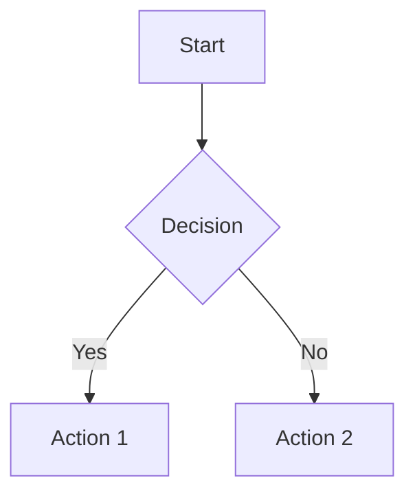

# s3-md-pdf-converter-mcp

[](https://badge.fury.io/js/s3-md-pdf-converter-mcp)
[](https://opensource.org/licenses/MIT)
[](https://github.com/modelcontextprotocol/typescript-sdk)
[](https://nodejs.org/)

A powerful **Model Context Protocol (MCP) server** that converts Markdown files and content to beautifully styled PDFs with **S3 integration**, **Mermaid diagrams** and **ApexCharts** support. Built with **MCP SDK 1.16.x** featuring **all transport modes**: stdio, HTTP, and SSE.

## ✨ Features

### 🚀 **Transport Layer Support (MCP SDK 1.16.x)**
- **stdio**: Perfect for Claude Desktop integration
- **Streamable HTTP**: Modern web applications with session management
- **SSE (Server-Sent Events)**: Legacy compatibility support
- **CORS enabled**: Browser-friendly with proper headers
- **DNS rebinding protection**: Enhanced security

### 📄 **PDF Conversion**
- 🔄 **Three conversion modes**: File-to-PDF, content-to-PDF, and S3-to-PDF
- ☁️ **S3 Integration**: Direct download from S3 buckets and upload PDFs back to S3
- 📊 **Charts & diagrams**: Mermaid diagrams + ApexCharts support
- 🎨 **Modern styling**: Professional typography with syntax highlighting
- 📄 **Multiple formats**: A4, A3, A5, Letter, Legal, Tabloid
- ⚙️ **Configurable margins**: Custom spacing in inches, mm, cm
- 📝 **Front matter support**: YAML metadata for document properties
- 🎯 **Accessibility**: Tagged PDFs with proper outline structure
- 📦 **Large content support**: JSON structure for handling 10,000+ line documents

## 🚀 Quick Start

### Option 1: Use with npx (Recommended)
```bash
# Default stdio mode (for Claude Desktop)
npx s3-md-pdf-converter-mcp

# HTTP server mode
npx s3-md-pdf-converter-mcp http 3000

# SSE server mode (legacy)
npx s3-md-pdf-converter-mcp sse 3001
```

### Option 2: Global Installation
```bash
npm install -g s3-md-pdf-converter-mcp

# Run in different modes
s3-md-pdf-converter-mcp              # stdio (default)
s3-md-pdf-converter-mcp http 3000    # HTTP server
s3-md-pdf-converter-mcp sse 3001     # SSE server
```

## 🔧 Integration Options

### Claude Desktop (stdio)
Add to your Claude Desktop configuration:

**Windows**: `%APPDATA%\Claude\claude_desktop_config.json`
**macOS**: `~/Library/Application Support/Claude/claude_desktop_config.json`

```json
{
  "mcpServers": {
    "s3-markdown-pdf": {
      "command": "npx",
      "args": ["s3-md-pdf-converter-mcp"]
    }
  }
}
```

### HTTP Server
```bash
# Start HTTP server on port 3000
npx s3-md-pdf-converter-mcp http 3000

# Or with npm
npm run start:http
```

### SSE Server (Legacy)
```bash
# Start SSE server on port 3001
npx s3-md-pdf-converter-mcp sse 3001

# Or with npm
npm run start:sse
```

Restart Claude Desktop after configuration.

## 📖 Usage Examples

### Convert Markdown File to PDF
```
"Convert my README.md file to PDF and save it as documentation.pdf"
```

### Convert Markdown Content to PDF
```
"Take this markdown content and create a PDF with A4 format:
# My Document
This is **bold** text with a [link](https://example.com)
"
```

### S3 Integration
```
"Convert S3 markdown from bucket 'my-docs' key 'report.md' and save to 'output.pdf'"
"Convert S3 markdown from bucket 'docs' key 'readme.md' and upload PDF to S3 with key 'readme.pdf' and uploadToS3 true"
```

### Large Content Support
```
"Convert this large markdown content to PDF: {content: 'Main content...', chunks: ['Section 1...', 'Section 2...']}"
```

### Custom Formatting
```
"Convert the markdown file with custom margins of 1 inch on all sides and Letter format"
```

### Charts & Diagrams

**ApexCharts:**
```markdown
# Sales Data

```chart
{
  "chart": { "type": "line", "height": 350 },
  "series": [{ "name": "Sales", "data": [30, 40, 35, 50, 49, 60, 70] }],
  "xaxis": { "categories": ["Jan", "Feb", "Mar", "Apr", "May", "Jun", "Jul"] }
}
```
```

**Mermaid:**
```markdown

```

## 🚀 Transport Modes (MCP SDK 1.16.x)

This server implements **all transport modes** from the latest MCP SDK, making it compatible with various integration scenarios:

### 💻 stdio (Default) - Claude Desktop Ready
**Perfect for**: Claude Desktop, command-line tools, direct integrations
```bash
npx md-mermaid-chart-pdf-mcp
```
**Features:**
- Zero configuration required
- Direct stdin/stdout communication
- Ideal for desktop AI applications
- Automatic process lifecycle management

### 🌐 Streamable HTTP - Modern Web Applications
**Perfect for**: Web applications, microservices, cloud deployments
```bash
npx md-mermaid-chart-pdf-mcp http 3000
```
**Features:**
- **Endpoints**: `POST/GET/DELETE /mcp`
- **Session management** with `mcp-session-id` header
- **CORS enabled** for browser clients
- **DNS rebinding protection** for security
- **Stateful sessions** with automatic cleanup
- **Error handling** with proper HTTP status codes

**Integration Example:**
```javascript
// Browser/Node.js client
const response = await fetch('http://localhost:3000/mcp', {
  method: 'POST',
  headers: {
    'Content-Type': 'application/json',
    'mcp-session-id': sessionId // Optional for new sessions
  },
  body: JSON.stringify(mcpRequest)
});
```

### 📡 SSE (Server-Sent Events) - Legacy Support
**Perfect for**: Backwards compatibility, existing SSE-based systems
```bash
npx md-mermaid-chart-pdf-mcp sse 3001
```
**Features:**
- **SSE endpoint**: `GET /sse` for real-time notifications
- **Message endpoint**: `POST /messages` for client requests
- **Session-based** communication
- **Legacy compatibility** with older MCP implementations

**Integration Example:**
```javascript
// SSE connection for notifications
const eventSource = new EventSource('http://localhost:3001/sse');

// POST messages for requests
fetch('http://localhost:3001/messages?sessionId=abc123', {
  method: 'POST',
  body: JSON.stringify(mcpRequest)
});
```

## 🛠️ Available Tools

### `convert_markdown_to_pdf`
Converts a markdown file to PDF (supports local files, URLs, and S3 URLs).

**Parameters:**
- `markdownPath` (string): Path to the markdown file (local path or URL)
- `outputPath` (string): Where to save the PDF
- `format` (optional): Page format (A4, A3, A5, Letter, Legal, Tabloid)
- `margin` (optional): Custom margins object

### `convert_s3_markdown_to_pdf`
Converts a markdown file from S3 bucket to PDF using bucket and key parameters.

**Parameters:**
- `bucket` (string): S3 bucket name
- `key` (string): S3 object key (path to the markdown file)
- `outputPath` (string): Where to save the PDF (local path or S3 key for upload)
- `uploadToS3` (boolean, optional): Whether to upload the PDF back to the same S3 bucket
- `region` (string, optional): AWS region (defaults to us-east-1)
- `format` (optional): Page format (A4, A3, A5, Letter, Legal, Tabloid)
- `margin` (optional): Custom margins object

### `markdown_content_to_pdf`
Converts markdown content directly to PDF (supports large content with JSON structure).

**Parameters:**
- `markdownContent` (string or object): Markdown content to convert (string or JSON object with content/chunks)
- `outputPath` (string): Where to save the PDF
- `title` (optional): Document title
- `format` (optional): Page format
- `margin` (optional): Custom margins object

## 📚 API Documentation

### MCP Protocol Methods

#### `tools/list`
Returns available tools for PDF conversion.

**Response:**
```json
{
  "tools": [
    {
      "name": "convert_markdown_to_pdf",
      "title": "Convert Markdown File to PDF",
      "description": "Convert a markdown file to PDF",
      "inputSchema": { /* Zod schema */ }
    },
    {
      "name": "markdown_content_to_pdf",
      "title": "Convert Markdown Content to PDF",
      "description": "Convert markdown content directly to PDF",
      "inputSchema": { /* Zod schema */ }
    }
  ]
}
```

#### `tools/call`
Execute PDF conversion tools.

**Request:**
```json
{
  "name": "convert_markdown_to_pdf",
  "arguments": {
    "markdownPath": "./README.md",
    "outputPath": "./output.pdf",
    "format": "A4",
    "margin": {
      "top": "1in",
      "right": "0.5in",
      "bottom": "1in",
      "left": "0.5in"
    }
  }
}
```

**Response:**
```json
{
  "content": [
    {
      "type": "text",
      "text": "Successfully converted markdown to PDF!\nInput: ./README.md\nOutput: /full/path/output.pdf"
    }
  ]
}
```

### HTTP API Endpoints (HTTP Transport)

#### `POST /mcp`
Main MCP communication endpoint.

**Headers:**
- `Content-Type: application/json`
- `mcp-session-id: <session-id>` (optional for new sessions)

**Request Body:** Standard MCP JSON-RPC 2.0 message

#### `GET /mcp`
Server-to-client notifications via Server-Sent Events.

**Headers:**
- `mcp-session-id: <session-id>` (required)

#### `DELETE /mcp`
Terminate MCP session.

**Headers:**
- `mcp-session-id: <session-id>` (required)

### SSE API Endpoints (SSE Transport)

#### `GET /sse`
Establish SSE connection for notifications.

**Response:** Server-Sent Events stream

#### `POST /messages`
Send MCP messages to server.

**Query Parameters:**
- `sessionId: <session-id>` (required)

**Request Body:** Standard MCP JSON-RPC 2.0 message

## 🎨 Supported Markdown Features

- **Headers**: H1-H6 with modern styling
- **Text formatting**: Bold, italic, strikethrough
- **Lists**: Ordered and unordered with custom bullets
- **Tables**: Styled with alternating row colors
- **Code blocks**: Syntax highlighting for 100+ languages
- **Blockquotes**: Elegant left-border styling
- **Links**: Styled with hover effects
- **Images**: Embedded with proper scaling
- **Charts**: ApexCharts (line, bar, pie, area, etc.) via `chart` blocks
- **Mermaid diagrams**: Flowcharts, sequence, gantt, and more

## 🛠️ Installation & Deployment

### Local Development
```bash
# Clone and install
git clone https://github.com/skmprb/s3-md-pdf-converter-mcp.git
cd s3-md-pdf-converter-mcp
npm install
npm run build

# Run in different modes
npm start              # stdio mode
npm run start:http     # HTTP server on port 3000
npm run start:sse      # SSE server on port 3001
```

### Production Deployment

#### Docker (Recommended)
```dockerfile
FROM node:18-alpine
WORKDIR /app
COPY package*.json ./
RUN npm ci --only=production
COPY . .
RUN npm run build
EXPOSE 3000
CMD ["npm", "run", "start:http"]
```

#### PM2 Process Manager
```bash
# Install globally
npm install -g s3-md-pdf-converter-mcp pm2

# Start with PM2
pm2 start "s3-md-pdf-converter-mcp http 3000" --name s3-mcp-pdf-server
pm2 startup
pm2 save
```

#### Systemd Service
```ini
[Unit]
Description=MCP PDF Converter Server
After=network.target

[Service]
Type=simple
User=mcp
WorkingDirectory=/opt/mcp-pdf
ExecStart=/usr/bin/node /opt/mcp-pdf/build/index.js http 3000
Restart=always
RestartSec=10

[Install]
WantedBy=multi-user.target
```

### Cloud Deployment

#### Vercel/Netlify Functions
```javascript
// api/mcp.js
import { createServer, setupServer } from '../src/index.js';

export default async function handler(req, res) {
  const server = createServer();
  setupServer(server);
  // Handle MCP requests
}
```

#### AWS Lambda
```javascript
// lambda.js
import { McpServer } from '@modelcontextprotocol/sdk/server/mcp.js';

export const handler = async (event, context) => {
  // Lambda handler for MCP requests
};
```

## 📋 Requirements & Compatibility

### System Requirements
- **Node.js 18+** (LTS recommended)
- **Chrome/Chromium** (automatically installed with Puppeteer)
- **Memory**: 512MB+ available RAM for PDF generation
- **Disk**: 200MB+ for Chromium and dependencies

### MCP Compatibility
- **MCP SDK**: 1.16.x (latest with all transport modes)
- **Protocol Version**: 2024-11-05 and later
- **Backwards Compatible**: Supports legacy SSE transport
- **Client Support**: Claude Desktop, custom MCP clients

### Transport-Specific Requirements
| Transport | Port | Dependencies | Use Case |
|-----------|------|--------------|----------|
| stdio | N/A | None | Claude Desktop, CLI |
| HTTP | 3000+ | express, cors | Web apps, APIs |
| SSE | 3001+ | express | Legacy systems |

## 🔧 Configuration Examples

### Custom Margins
```json
{
  "margin": {
    "top": "1in",
    "right": "0.5in",
    "bottom": "1in",
    "left": "0.5in"
  }
}
```

### Front Matter Support
```yaml
---
title: My Document
author: John Doe
date: 2024-01-01
---

# Document Content
Your markdown content here...
```

### Environment Variables
```bash
# Server configuration
MCP_PORT=3000                    # HTTP server port
MCP_HOST=localhost               # HTTP server host
MCP_CORS_ORIGIN=*               # CORS allowed origins
MCP_SESSION_TIMEOUT=3600000     # Session timeout (ms)

# PDF generation
PDF_TIMEOUT=30000               # PDF generation timeout (ms)
PDF_QUALITY=100                 # PDF quality (1-100)
CHROME_ARGS="--no-sandbox"      # Additional Chrome arguments
```

## ⚡ Performance & Optimization

### PDF Generation Performance
- **Average conversion time**: 2-5 seconds for typical documents
- **Memory usage**: 100-300MB per conversion
- **Concurrent requests**: Supports multiple simultaneous conversions
- **Caching**: Automatic font and resource caching

### Optimization Tips
```javascript
// Optimize for large documents
const options = {
  format: 'A4',
  margin: { top: '0.5in', right: '0.5in', bottom: '0.5in', left: '0.5in' },
  // Reduce quality for faster generation
  printBackground: false,
  // Disable animations for better performance
  preferCSSPageSize: true
};
```

### Scaling Considerations
- **Horizontal scaling**: Deploy multiple instances behind load balancer
- **Resource limits**: Set appropriate memory limits (1GB+ recommended)
- **Queue management**: Implement request queuing for high load
- **Monitoring**: Track conversion times and error rates

## 🔍 Troubleshooting

### Common Issues

#### "Chrome not found" Error
```bash
# Install Chrome/Chromium manually
sudo apt-get install chromium-browser  # Ubuntu/Debian
brew install chromium                  # macOS

# Or set custom Chrome path
export CHROME_PATH=/path/to/chrome
```

#### Memory Issues
```bash
# Increase Node.js memory limit
node --max-old-space-size=4096 build/index.js

# Or set environment variable
export NODE_OPTIONS="--max-old-space-size=4096"
```

#### Port Already in Use
```bash
# Find process using port
lsof -i :3000

# Kill process
kill -9 <PID>

# Or use different port
npx s3-md-pdf-converter-mcp http 3001
```

#### CORS Issues
```javascript
// Custom CORS configuration
app.use(cors({
  origin: ['https://yourdomain.com'],
  credentials: true,
  exposedHeaders: ['Mcp-Session-Id']
}));
```

### Debug Mode
```bash
# Enable debug logging
DEBUG=mcp:* npx s3-md-pdf-converter-mcp http 3000

# Verbose Puppeteer logging
DEBUG=puppeteer:* npx s3-md-pdf-converter-mcp
```

### Health Check Endpoint
```bash
# Add to your HTTP server
app.get('/health', (req, res) => {
  res.json({
    status: 'healthy',
    version: '1.0.0',
    uptime: process.uptime(),
    memory: process.memoryUsage()
  });
});
```

## 🤝 Contributing

1. Fork the repository
2. Create your feature branch (`git checkout -b feature/amazing-feature`)
3. Commit your changes (`git commit -m 'Add amazing feature'`)
4. Push to the branch (`git push origin feature/amazing-feature`)
5. Open a Pull Request

## 📄 License

This project is licensed under the MIT License - see the [LICENSE](LICENSE) file for details.

## 📊 Feature Comparison

| Feature | stdio | HTTP | SSE | Notes |
|---------|-------|------|-----|-------|
| Claude Desktop | ✅ | ❌ | ❌ | Primary use case |
| Web Applications | ❌ | ✅ | ✅ | HTTP recommended |
| Session Management | ❌ | ✅ | ✅ | Stateful connections |
| CORS Support | N/A | ✅ | ✅ | Browser compatibility |
| Real-time Notifications | ❌ | ✅ | ✅ | Server-to-client |
| DNS Protection | N/A | ✅ | ❌ | Security feature |
| Process Lifecycle | Auto | Manual | Manual | Automatic cleanup |
| Scalability | Low | High | Medium | Concurrent connections |
| Setup Complexity | None | Low | Medium | Configuration required |

## 🛡️ Security Considerations

### HTTP Transport Security
- **DNS Rebinding Protection**: Enabled by default
- **CORS Configuration**: Properly configured origins
- **Session Validation**: Secure session ID generation
- **Input Sanitization**: All inputs validated with Zod schemas

### Production Security Checklist
- [ ] Use HTTPS in production
- [ ] Configure specific CORS origins (not `*`)
- [ ] Set up proper firewall rules
- [ ] Enable rate limiting
- [ ] Monitor for suspicious activity
- [ ] Regular security updates

```javascript
// Production CORS configuration
app.use(cors({
  origin: [
    'https://yourdomain.com',
    'https://app.yourdomain.com'
  ],
  credentials: true,
  exposedHeaders: ['Mcp-Session-Id'],
  allowedHeaders: ['Content-Type', 'mcp-session-id']
}));
```

## 📜 Related Projects

- **[MCP TypeScript SDK](https://github.com/modelcontextprotocol/typescript-sdk)**: Official MCP SDK
- **[Claude Desktop](https://claude.ai/desktop)**: AI assistant with MCP support
- **[Puppeteer](https://pptr.dev/)**: Headless Chrome for PDF generation
- **[Mermaid](https://mermaid.js.org/)**: Diagram and flowchart library
- **[ApexCharts](https://apexcharts.com/)**: Interactive chart library

## 🐛 Issues & Support

Found a bug or need help? Please [open an issue](https://github.com/skmprb/s3-md-pdf-converter-mcp/issues) on GitHub.

### Before Opening an Issue
1. Check existing issues for duplicates
2. Include your Node.js version
3. Specify which transport mode you're using
4. Provide sample markdown content (if applicable)
5. Include error logs and stack traces

## 🌟 Show Your Support

Give a ⭐️ if this project helped you!

### Ways to Contribute
- ⭐ Star the repository
- 🐛 Report bugs and issues
- 💡 Suggest new features
- 📝 Improve documentation
- 🔧 Submit pull requests
- 💬 Share your use cases

---

**Built with ❤️ using [MCP SDK 1.16.x](https://github.com/modelcontextprotocol/typescript-sdk) and [AWS SDK v3](https://docs.aws.amazon.com/AWSJavaScriptSDK/v3/latest/)**